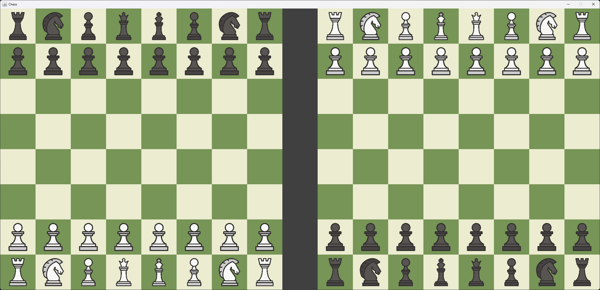

# Java Chess App


A simple Java-based chess application designed for **local two-player gameplay**. This app features **two boards side by side**, allowing both players to visualize their moves simultaneously, making it easier to track game states and practice strategies.



---


## Features


* **Local Two-Player Mode**: Play chess with a friend on the same computer.

* **Dual Boards**: Two boards displayed side by side for better visibility of each player’s perspective.

* **Turn-Based Gameplay**: Players alternate turns following standard chess rules.

* **Piece Movement Validation**: Enforces legal chess moves.

* **Simple and Intuitive GUI**: Clean interface built with Java Swing for easy interaction.


---


## Installation


The file structure is based on the default netBeans IDE project structure. Use this IDE (version 25 or higher) to open and run the projecct for the bast experience.


1. Ensure you have **Java JDK 8 or higher** installed.

2. Clone the repository:


```bash

git clone https://github.com/Cantox/Chess.git

```

3. Navigate to the classes directory:


```bash

cd chess/build/classes

```


4. Run the application:


```bash

java main.Main

```


---


## Usage


1. Launch the application.

2. Two chess boards will appear side by side.

3. Player 1 starts by moving their pieces on the left board.

4. Player 2 moves on the right board.

5. Continue alternating turns until checkmate or stalemate.


---


## Modify textures

You can **modify the used textures** by changing the files inside `_resourcepacks/default`; make sure you **don't change the file names**. You can also **add you own packs** using the same structure of the default pack and then **modifying the path** inside `Settings.java`. You can also change any other setting like colors or tile dimension in that file. Remember to **rebuild the project** after the changes.


